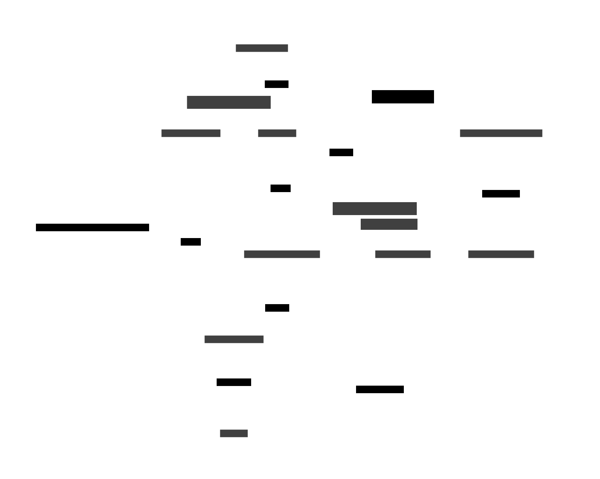

# Runner Init / GOAT

[](https://dl.circleci.com/status-badge/redirect/gh/circleci/runner-init/tree/main)

## Introduction


`runner-init` is a core component of CircleCI's [container runner](https://circleci.com/docs/container-runner/), introduced in version `3.1.0`, to improve performance and reliability of task orchestration within Kubernetes environments. This project consists of two main elements:
1) **The `runner-init` Docker image** - Used by an init container, this image is responsible for distributing the GOAT (**G**eneral **O**rchestration **A**gen**T**) and [task agent](https://circleci.com/docs/runner-concepts/#task-agent) binaries. It achieves this by copying the binaries into the primary task container via an ephemeral volume, making it available before task execution begins.
2) **GOAT** - The core binary delivered by `runner-init`, which runs as the main process (PID 1) in the container. GOAT is responsible for bootstrapping and managing task agent, the process that ultimately runs the task steps.

## Design

### Background
The previous container runner architecture (version `3.0.x`) relied heavily on Kubernetes' `exec` API to copy the task agent binary into the primary container and execute commands remotely from container agent. However, this API wasn't designed for such intensive use, resulting in errors, loss of idempotency during disconnections, and placing a high load on the Kubernetes API server. These issues ultimately led to network congestion within the cluster under heavy task loads.

To address these issues, we transitioned to an in-container orchestration agent, GOAT, which operates directly within the container environment, significantly reducing Kubernetes API load while adding other operational benefits.

### Key Improvements
- **Init container setup** - GOAT’s design uses an init container to copy the GOAT and task agent binaries to a shared ephemeral volume with the primary container. By using an init image, the binaries are cached on the node, rather than relying on container agent's local storage and the specific node it is on, improving startup efficiency.
- **GOAT as PID 1** - In Kubernetes, PID 1 is special, as it can handle container signals directly and determines the lifecycle of the container. This allows for GOAT to propagate signals to task agent, manage child process termination and reaping, and ensure a clean container exit on task completion, allowing container agent to efficiently clean up the task Pod.
- **Improved health cdhecks** - GOAT provides built-in health checks on port `7623` for liveness probes, replacing the previous reliance on `exec` probes, which required a container shell and were prone to false positives.
- **Shell independence** - GOAT encapsulates all task environment setup and management functions, eliminating reliance on the container’s shell, which wasn't always POSIX compliant. This extends container runner's compatability with a larger assortment of images that can be used for a task.
- **Better error reporting** - GOAT’s direct operation within the primary container provides better insight into task agent interruptions and failures, allowing for more detailed and actionable error reporting than was possible with the previous design’s remote execution model.

### Task Flow with GOAT



Under this setup, container agent provisions the task Pod with an ephemeral volume and an init container based on the `runner-init` image. This init container copies both the GOAT and task agent binaries to the shared volume, then exits, leaving the binaries accessible for the primary task container.

When the primary task container starts, GOAT runs as PID 1, executing the task agent process and any custom entrypoint specified in the CircleCI job config as a child process. GOAT manages init-like tasks, including handling signals to the container and performing process cleanup/reaping. On task completion, GOAT exits cleanly, causing the container to terminate and enabling container agent to clean up the Pod accordingly.

## Supported Platforms

The `runner-init` image and GOAT support the following Kubernetes container platforms:

| Platform | Architecture | Notes                                                                                                                                                                        |
|----------|-------------|------------------------------------------------------------------------------------------------------------------------------------------------------------------------------|
| Linux | amd64, arm64 | Full support for standard Linux containers on both x86-64 and ARM architectures                                                                                              |
| Windows | amd64 | **Preview** - Windows container support for x86-64 architecture. See [Windows container runner documentation](https://circleci.com/docs/container-runner/#windows) for setup |

## Project Layout

The `runner-init` project includes several key directories:
- `clients/runner` - Contains the HTTP client for the runner API, used for managing infra failures and retries of tasks.
- `cmd` - Contains the main function of GOAT, managing configuration setups such as loading root certificates and setting up health checks.
- `init` - Manages the init container functionality, responsible for copying both GOAT and task agent binaries to the primary container.
- `task` - This module is responsible for executing task agent with the provided configuration, handling process reaping, signal interception, and infra failure management during task execution.

### Testing Strategies

### Unit and Integration Tests
Unit tests in the project are located in files suffixed with `_test.go` and focus on testing modules or specific functions. These tests often cover broader functionalities than traditional unit tests and are more akin to integration tests, as seen in `./task/orchestrator_test.go`. Here we use a fake runner API that involves spinning up an actual HTTP server to test the calls the orchestrator makes, rather than using an interface and stubbing out the responses.
### Acceptance Tests
Located under `./acceptance`, these tests validate slices of system functionality using the compiled binary. They simulate the runner API and task agent using fakes found under `./internal/testing`. Acceptance tests are lighter weight compared to the smoke tests and have the advantage of testing both typical and unhappy paths due to the utilization of fakes.
### Smoke Tests
The smoke tests are run exclusively in CI using a published dev `runner-init` image. These tests involve provisioning actual container runner instances and running various synthetic jobs against them, testing the system within an actual CircleCI environment. The test suite is located in the [circleci/runner-smoke-tests](https://github.com/circleci/runner-smoke-tests) repository.

## Development

### Prerequisites

Make sure the following dependencies are installed:
- **Go** - The project uses Go, with the required version specified in the `go.mod` file. Install Go from the [official Go website](https://go.dev/dl/).

### Building the Project

Use the `do` script to build the project components. Under the hood, this script uses [GoReleaser](https://goreleaser.com/) with the default configuration defined in the `./.goreleaser` directory.
```bash
# Compile Go binaries for all target platforms
./do build
```
The resulting binaries are available under the `./target` directory.
```bash
# Build Docker images
./do images
```
The resulting Docker image, `runner-init:agent`, can be pushed to a repository of your choice. To use this image with a container runner instance, set the `agent.environment.DEBUG_RUNNER_INIT_VERSION` parameter to the image tag in the [Helm values](https://github.com/CircleCI-Public/container-runner-helm-chart?tab=readme-ov-file#values) for container runner.

### Running Tests

To run both unit and acceptance tests, execute:
```bash
./do test
```
This command performs both unit and acceptance testing as outlined in the [earlier section](#testing-strategies) on testing strategies.

To trigger the smoke tests, which runs in the [K9s](https://app.k9s.sphereci.com/home), the [On-Prem team's](https://github.com/orgs/circleci/teams/on-prem) [server](https://circleci.com/docs/server/latest/overview/circleci-server-overview/) dogfood environment, and requires additional privileges and settings:
```bash
SMOKE_TESTS_MACHINE_SKIP=true ./do smoke-tests
```
The smoke tests require write access to the [circleci/runner-smoke-tests](https://github.com/circleci/runner-smoke-tests) project and access to the [K9s CircleCI server environment](https://app.k9s.sphereci.com/pipelines/github/circleci/runner-smoke-tests). A `KUBERNETES_CIRCLE_API_TOKEN`, set to a CircleCI token with runner admin privileges, is required to trigger these tests. The `SMOKE_TESTS_MACHINE_SKIP=true` flag is used to skip [machine runner](https://circleci.com/docs/runner-concepts/#machine-runner-3) specific tests.

### Additional Commands

```bash
# Check the code for potential issues
./do lint

# Update and maintain the project's Go modules
./do go-mod-tidy

# See a full list of available options
./do help
```

## Releasing

Releases for the `runner-init` project are handled automatically in CI/CD when changes are merged into the `main` branch.

### Image Publishing

On each merge to `main`, the main workflow builds and publishes a Docker image tagged as `agent` to the [circleci/runner-init repository on Docker Hub](https://hub.docker.com/r/circleci/runner-init). This `agent` tag is a floating tag, which always points to the latest published image that includes the latest version of the task agent binary. The runner agent automatically pulls this image based on the task claim, ensuring that the most current version is used during task execution.

To ensure that the `runner-init` image remains up-to-date with the latest task agent binary, a Dockerhub webhook integration is configured to trigger a rebuild of the `agent` tag whenever the [picard image](https://hub.docker.com/r/circleci/picard), which contains the task agent binary, is updated. For more information on this integration, see the [CircleCI Webhooks docs](https://circleci.com/docs/webhooks/).

### CircleCI Server Images
For [CircleCI server](https://circleci.com/docs/server/latest/overview/circleci-server-overview/), specific images are built and published for each supported server version. Each server version is matched with its corresponding task agent binary version, which is pinned in each version. The versions for these server-specific images are defined and managed using the `images-for-server` command in the `./do` script.

## Maintenance

### Dependency Management
[Renovate](https://docs.renovatebot.com/) automatically generates pull requests to update dependencies for the `runner-init` project. The [On-Prem team's](https://github.com/orgs/circleci/teams/on-prem) on-call engineer is responsible for reviewing these PRs to ensure all tests and linting checks pass and to assess release notes for any potential breaking changes or issues.

### Security Scanning
Synk and Lacework are utilized for security scanning on the Docker images, identifying any vulnerabilities. Nightly scans detect CVEs and other security issues, alerting the team's `#runner-alerts` Slack channel. The on-call engineer should triage and remediate these detected vulnerabilities accordingly.
